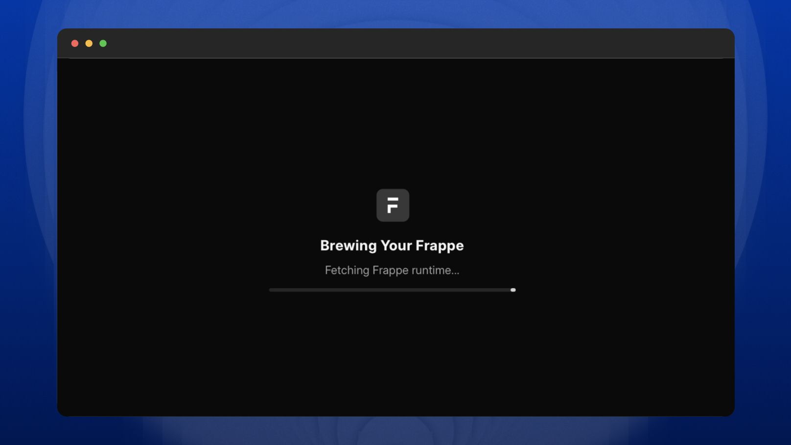

<p align="center"></p>



# Frappe Playground

Run the Frappe Framework in the browser with Pyodide and WebAssembly. The playground serves a Vue shell, boots Frappe inside a Web Worker, and routes same-origin Frappe requests through a Service Worker into Python WSGI. Runtime state is kept in the browser, so a tab can reload without needing a traditional Python server.

> [!CAUTION]
> Project is currently experimental and under active development.

## Overview

The playground has four main pieces:

1. **Vue shell (`src/`)**: Renders the loading screen, top bar, and Frappe Desk iframe. Vite builds this into `public/frontend/`.
2. **Service Worker (`public/sw.js`)**: Intercepts scoped browser requests, serves static files, mocks Socket.IO enough for Desk to settle, and forwards backend requests to the active Python worker.
3. **Pyodide worker (`public/worker.js`)**: Loads Pyodide, installs Python packages, mounts the Frappe runtime archive and starter SQLite database, applies browser-specific mocks, and handles WSGI requests.
4. **Runtime build (`Dockerfile.build`, `scripts/build.sh`)**: Builds the Frappe runtime, database, and Frappe browser assets into `storage/`. `scripts/prepare.sh` copies those generated assets into `public/storage/` and `public/assets/` for local preview or deploy.

The app must be served from `localhost` or HTTPS with cross-origin isolation headers:

```text
Cross-Origin-Opener-Policy: same-origin
Cross-Origin-Embedder-Policy: require-corp
Access-Control-Allow-Origin: *
```

Vite sets these headers during local development and preview. Cloudflare Pages uses `public/_headers`.

## Getting Started

Install dependencies:

```bash
npm install
```

Build the browser runtime with Docker:

```bash
npm run build:runtime
```

Copy the generated runtime and Frappe assets into `public/`:

```bash
bash scripts/prepare.sh
```

Start the local Vite dev server:

```bash
npm run dev
```

Open `http://localhost:5173/`.

For a production-style local preview, build the Vue shell and start Vite preview:

```bash
npm run build
npm run dev:preview
```

Open `http://localhost:8000/`.

To run the complete deploy preparation flow in one command:

```bash
npm run deploy:prepare
```

This rebuilds the runtime, prepares `public/`, builds the frontend shell, and checks published asset limits.

## Directory Structure

```text
frappe-playground/
|-- src/                    # Vue shell loaded by Vite
|-- public/
|   |-- sw.js               # Service Worker request router
|   |-- worker.js           # Pyodide + Frappe runtime worker
|   |-- config.js           # Runtime package and site configuration
|   |-- python/             # Browser-specific Python helpers and mocks
|   |-- assets/             # Generated Frappe browser assets
|   |-- frontend/           # Generated Vue shell assets
|   `-- storage/            # Generated runtime archive and starter database
|-- scripts/
|   |-- build.sh            # Docker runtime build
|   |-- prepare.sh          # Copies generated runtime assets into public/
|   `-- prepare-deploy.sh   # Full deploy preparation flow
|-- tests/
|   |-- e2e/                # Playwright browser flows
|   `-- debug/              # Runtime inspection helpers
|-- Dockerfile.build
|-- vite.config.mjs
`-- playwright.config.js
```

Generated directories such as `storage/`, `public/assets/`, `public/frontend/`, and `public/storage/` are intentionally ignored by Git.

## Testing

The Playwright suite uses `http://localhost:8000` as its base URL. After building the frontend with `npm run build` or `npm run deploy:prepare`, run the production preview before executing tests:

```bash
npm run dev:preview
```

In another terminal:

```bash
npm run test
```

The e2e tests cover boot, login, setup wizard completion, Desk stability, scoped reload behavior, and the mobile shell.

Debug helpers can inspect the running Pyodide environment:

```bash
# Inspect a file inside the Pyodide virtual filesystem
npm run debug:vfs /home/pyodide/bench/sites/site1/site_config.json

# Dump the active in-browser cookie jar
npm run debug:memory
```

## Deployment

Build the deployable `public/` tree without publishing:

```bash
npm run deploy:prepare
```

Deploy to Cloudflare Pages:

```bash
npm run deploy
```

`npm run deploy` also runs `predeploy`, which prepares the runtime and frontend before publishing with `scripts/deploy.sh`.

## Meet Your Artisans

[LUBUS](https://lubus.in/?utm_source=github&utm_medium=open-source&utm_campaign=frappe-playground) is a web design agency based in Mumbai.

<a href="https://cal.com/lubus">

</a>

## License

Frappe Playground is open-sourced licensed under the [MIT License](LICENSE).
